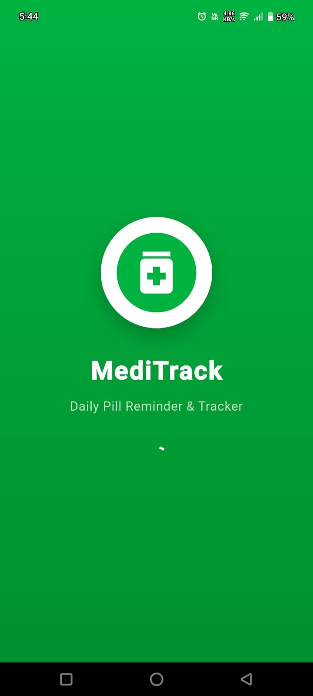
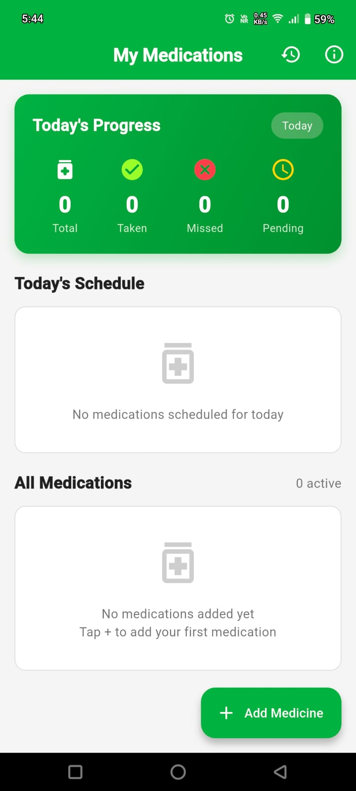
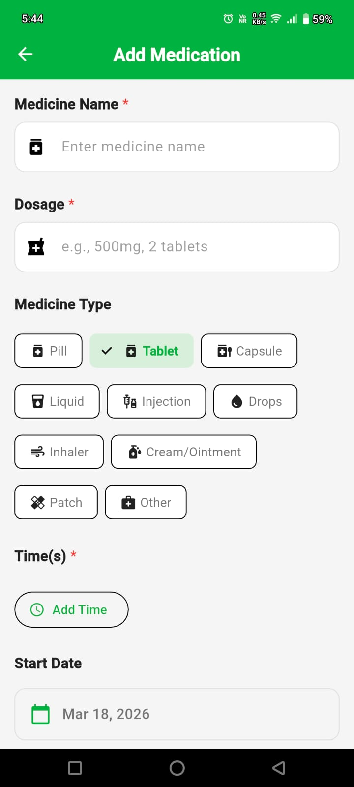
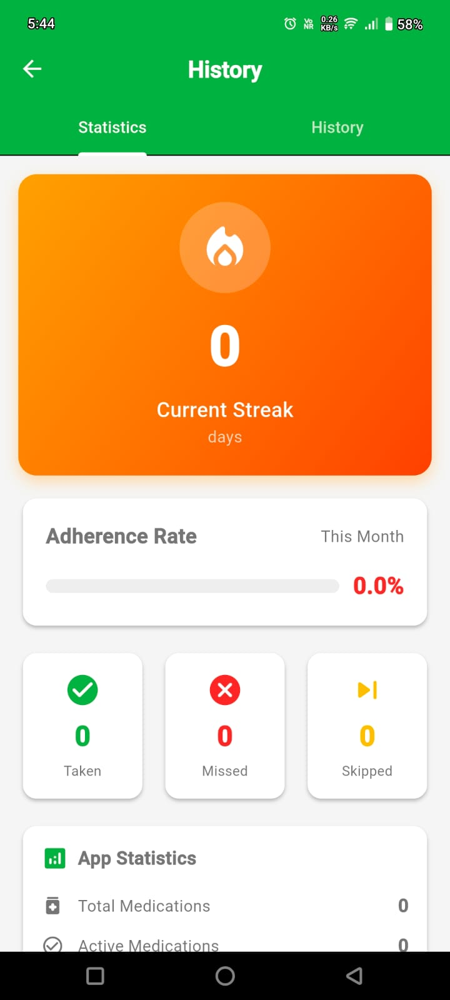
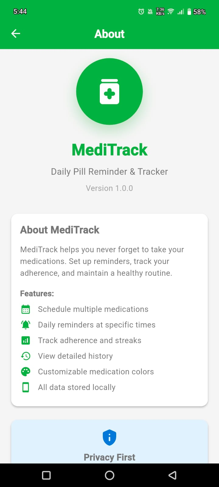

# 💊 MediTrack

**MediTrack** is a simple and powerful **Daily Medication Reminder & Tracker** app that helps users stay consistent with their medications and maintain a healthy routine.

---

## ✨ Features

- 📅 Schedule multiple medications
- ⏰ Set daily reminders at specific times
- 📊 Track adherence and streaks
- 📜 View detailed medication history
- 🎨 Customizable medication types
- 🔒 Privacy-first (all data stored locally)

---

## 📱 Screenshots

| 🟢 Splash Screen | 🏠 Home Screen | ➕ Add Medication |
|----------------|--------------|------------------|
|  |  |  |

| 📊 Statistics | ℹ️ About |
|--------------|----------|
|  |  |

---

## 🛠️ Tech Stack

- **Flutter**
- **Dart**
- Local Storage (Offline-first)
- Notifications API

---

## 🚀 Getting Started

### Prerequisites

- Flutter SDK installed
- Android Studio / VS Code

### Installation

```bash
git clone https://github.com/your-username/meditrack.git
cd meditrack
flutter pub get
flutter run
```

---

## 📂 Project Structure

```
lib/
├── models/
├── services/
├── screens/
├── widgets/
├── utils/
```

---

## 🔔 Permissions Used

- Notification Access
- Exact Alarm Scheduling
- Boot Completed (for rescheduling reminders)

---

## 🎯 Future Improvements

- ☁️ Cloud sync
- 👨‍⚕️ Doctor sharing feature
- 📈 Advanced analytics
- 🌙 Dark mode

---

## 🤝 Contributing

Contributions are welcome!  
Feel free to fork this repo and submit a pull request.

---
